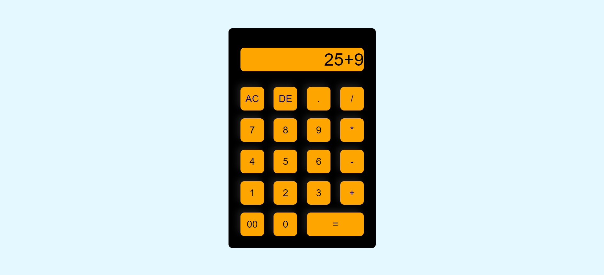

# Calculator-HTML-CSS-and-JS
A simple calculator application that performs basic arithmetic operations like addition, subtraction, multiplication, and division. Designed for ease of use, it features an intuitive interface and handles invalid inputs gracefully.

## Features
<ul>-Clean and intuitive user interface created with HTML and CSS.</ul>
<ul>-Basic arithmetic operations: addition, subtraction, multiplication, and division.</ul>
<ul>-Clear button to reset the calculator for new calculations.</ul>

## Screenshot
<ul></ul>
